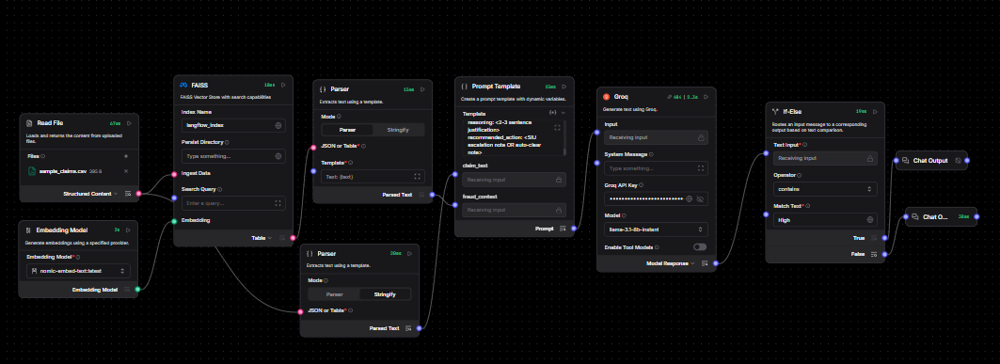

# Claims Fraud Triage — Langflow Project



A local-first insurance claims fraud triage pipeline built in Langflow. It ingests a CSV of incoming claims, retrieves similar historical fraud patterns using a FAISS vector store, scores each claim's fraud risk with an LLM, and routes high-risk claims to a human SIU (Special Investigations Unit) review queue while auto-clearing low-risk claims.

## Problem It Solves

Insurance adjusters manually review every claim for fraud red flags even though the majority of claims are legitimate. This flow automates the triage step — flagging the minority of claims that actually warrant investigator time — while keeping a human in the loop for any high-risk decision.

## Architecture

```
Read File (claims CSV)
      │
      ├──► Parser (Stringify) ──► Prompt Template [claim_text]
      │
      └──► FAISS [Ingest Data]
                 │
Embedding Model ─┘ [Embedding]
                 │
           Search Results (Table view)
                 │
                 ▼
           Parser (Parser mode, template: {text})
                 │
                 ▼
           Prompt Template [fraud_context]
                 │
                 ▼
              Groq LLM
                 │
                 ▼
              If-Else (contains "High")
              ├── True  ──► Chat Output: SIU Escalation
              └── False ──► Chat Output: Auto-Cleared
```

## Components Used

| Component | Role |
|---|---|
| **Read File** | Loads the claims CSV |
| **Parser** (x2) | Converts Data objects into plain text for the prompt |
| **Embedding Model** | Generates embeddings (`nomic-embed-text:latest`) for the FAISS index |
| **FAISS** | Local vector store — ingests claim text and retrieves similar historical fraud patterns |
| **Prompt Template** | Combines claim details + retrieved fraud context into a scoring prompt |
| **Groq** | LLM that outputs `risk_level`, `reasoning`, and `recommended_action` |
| **If-Else** | Routes based on whether the LLM output contains "High" |
| **Chat Output** (x2) | Terminal nodes for SIU Escalation vs. Auto-Cleared results |

## Setup

1. Import/build the flow in Langflow (see wiring notes below).
2. Set your **Groq API Key** in the Groq node.
3. Confirm the **Embedding Model** is available locally (`nomic-embed-text:latest`).
4. Upload a claims CSV to the **Read File** node. Expected columns:
   `claim_id, claimant, incident_date, amount, description, prior_claims_count`

## Key Wiring Notes (from build/debug process)

- **Read File → Parser**: connect `Structured Content` → `JSON or Table` (not `Template` — that's a manually-typed field, not a connection point).
- **Read File-side Parser**: use **Stringify** mode (avoids `KeyError` from guessing a field key that doesn't exist in the Data object).
- **FAISS `Ingest Data`**: feed directly from Read File's `Structured Content` (Data type) — do not route through a Parser first, since Parser outputs Message type and `Ingest Data` expects Data.
- **FAISS `Search Query`**: optional. Can be left empty/static since ingestion and retrieval both key off the claim text already flowing through the graph.
- **FAISS output**: switch the `Search Results` view from **Data/JSON** to **Table** — this is required for the downstream Parser to handle it (raw Data/JSON list throws "List of Data objects is not supported").
- **FAISS-side Parser**: use **Parser** mode (not Stringify) with template `{text}`, since Table-formatted search results expose a `text` field.
- **FAISS pickle deserialization error**: enable `allow_dangerous_deserialization` on the FAISS node (safe only because you control the local index file yourself).
- **Prompt Template**: has two input handles generated from its template variables — `claim_text` and `fraud_context`. Wire the Read File Parser's output to `claim_text` and the FAISS Parser's output to `fraud_context`.
- **If-Else**: set `Operator` to `contains` (not `equals`) and `Match Text` to `High`, since the LLM's full response text needs to be scanned for the risk level, not matched exactly.

## Prompt Template

```
You are a claims fraud triage analyst.

Claim details:
{claim_text}

Similar historical fraud patterns retrieved from case history:
{fraud_context}

Instructions:
1. Assess this claim's fraud risk based on the details and any similarity to known fraud patterns.
2. Consider: claim amount vs. typical range, prior claims count, description consistency, timing red flags.
3. Respond ONLY in this exact format:
risk_level: HIGH or LOW
reasoning: <2-3 sentence justification>
recommended_action: <SIU escalation note OR auto-clear note>
```

## Sample Test Data

`sample_claims.csv` includes three test rows:

| claim_id | Expected Result | Why |
|---|---|---|
| C-1001 | LOW | Routine claim, low amount, consistent details |
| C-1002 | HIGH | Large amount, new policy, inconsistent damage description, prior claims |
| C-1003 | LOW | Small, straightforward claim |

## Known Limitations / Next Steps

- Currently a single-claim-at-a-time flow; batch processing across all CSV rows would need a loop/batch component.
- No persistent audit log of past decisions — recommend adding a database write step (e.g., Postgres) after the If-Else for compliance record-keeping.
- High-risk claims currently just route to Chat Output; in production this should notify/create a ticket for the SIU team (e.g., Slack, email, or a ticketing system webhook) rather than sit in the Playground.
- No explicit human-approval gate before any downstream action is taken — by design in this MVP, the flow only *recommends*, and a human must act on the SIU Escalation output manually.
